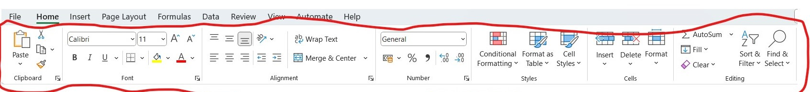
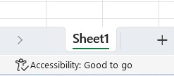
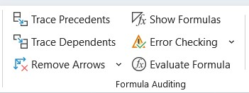

  
  ```{r setup, include=FALSE}
knitr::opts_chunk$set(echo = TRUE)
```


# EXCEL ADVANCE TRAINING {.tabset}

## Welcome 


## Introduction 

For this training will be looking at <mark>spreadsheets</mark> using the Microsoft Excel.

Numerous spread sheet application/software are available just to name a few:

  - Microsoft Excel {width=10px}
  - LibreOffice {width=100px}
  - Google sheets {width=10px}


Some of the spreadsheets are paid for others a free and open source.
Access can be both online (using your browers i.e. Internet Explorer/Google Chrome/Mozilla) and offline (As a stand alone software installed on your computer/mobile phone)


### Assumptions

Have some limited or little knowledge of Microsoft excel functions e.g `=sum(C1,C2)`, though not mandatory it makes it easier to grasp concepts slightly faster.

Though if you remember the simple mathematics which we do everyday of summing and adding up *money* then you are good :).

### Requirements

* Working computer (Laptop/Desktop)
* Access to internet once in a while to download a few resource materials
* **Interest and desire** to learn new concepts


### Overview of our knowledge

* Operating and maneuvering on a PC/Laptop
* Basic knowledge of Ms Excel Interface


### Teaching guide

* Mixed instructional guide, with the presentation but focused on getting more hard skills
* Prepare to write Excel formulas
* Engagements and practice on the fly


## Day 1 {.tabset .tabset-pills}


### Navigating Ms Excel

**Key Guiding Concepts**

Vocabulary to be used.

- **Menu Bar**
  
- **Menu Ribbon**
  
- **Sheet**

  {width=150px}
- **Formula**
  Inputs placed inside cells to do various calculations
  
- **Rows**
  Horizontal cells from `1` to Maximum of `1048576`

- **Columns**
  Vertical cells from `A` to Maximum of `XFD`
  
  
<video src="Images/ex_menu_ribon.mp4" width="320" height="240" controls></video>
  
## Day 2 {.tabset .tabset-pills}
## Day 3 {.tabset .tabset-pills}
## Day 4 {.tabset .tabset-pills}

  
## Bonus Materials {.tabset .tabset-pills}

### **Other Concepts**

- Locating formulas
- Auditing Tools {width=150px}
- Column/Row References `A:A` / `1:1`
- 

### **Shortcut CheatSheet**

-
-
